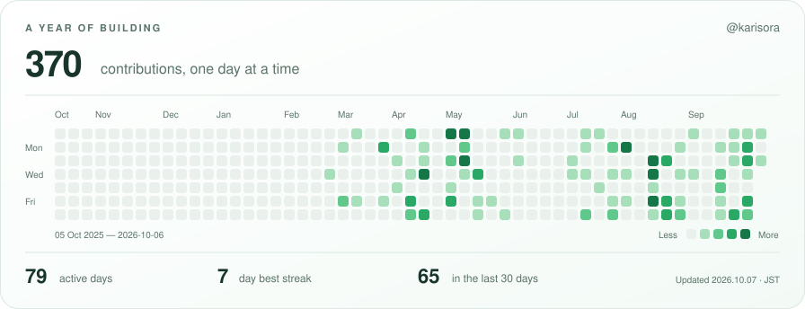
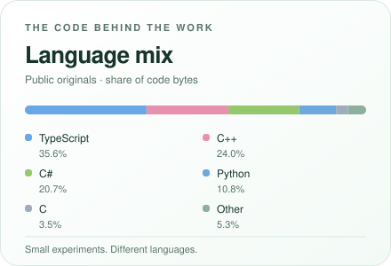
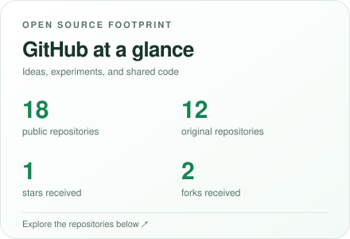
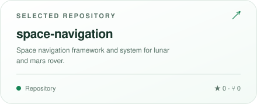
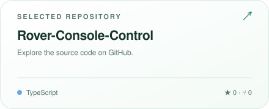
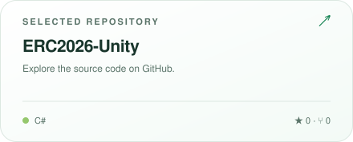
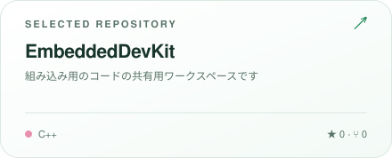

  <a href="https://github.com/karisora?tab=overview">
    <picture>
      <source media="(prefers-color-scheme: dark)" srcset="output/activity-dark.svg" />
      
    </picture>
  </a>

# Sora Karimata

Undergraduate developer based in Sendai, Japan.

  
  
  

## Languages & GitHub

  <a href="https://github.com/karisora?tab=repositories">
    <picture>
      <source media="(prefers-color-scheme: dark)" srcset="output/languages-dark.svg" />
      
    </picture>
  </a>
  <a href="https://github.com/karisora?tab=repositories">
    <picture>
      <source media="(prefers-color-scheme: dark)" srcset="output/overview-dark.svg" />
      
    </picture>
  </a>

## Selected work

<!-- PROJECTS:START -->

  <a href="https://github.com/karisora/space-navigation">
    <picture>
      <source media="(prefers-color-scheme: dark)" srcset="output/repository-space-navigation-dark.svg" />
      
    </picture>
  </a>
  <a href="https://github.com/karisora/Rover-Console-Control">
    <picture>
      <source media="(prefers-color-scheme: dark)" srcset="output/repository-Rover-Console-Control-dark.svg" />
      
    </picture>
  </a>

  <a href="https://github.com/karisora/ERC2026-Unity">
    <picture>
      <source media="(prefers-color-scheme: dark)" srcset="output/repository-ERC2026-Unity-dark.svg" />
      
    </picture>
  </a>
  <a href="https://github.com/karisora/EmbeddedDevKit">
    <picture>
      <source media="(prefers-color-scheme: dark)" srcset="output/repository-EmbeddedDevKit-dark.svg" />
      
    </picture>
  </a>

<!-- PROJECTS:END -->

  <a href="https://github.com/karisora?tab=repositories">All repositories ↗</a>
  &nbsp; · &nbsp;
  <a href="https://github.com/karisora?tab=overview">Live contribution graph ↗</a>

